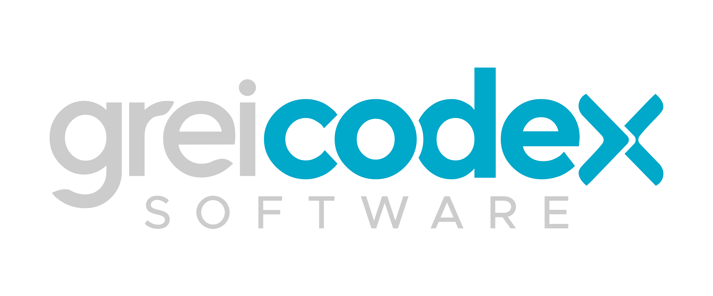

<p align="center">
  <a href="https://github.com/GreicodexJM">
    
  </a>
</p>
<p align="center">
  
</p>

# CorePHP
{: .fs-9 }

A production-grade, persistent PHP 8.4 runtime that brings JVM-like stability to PHP.
{: .fs-6 .fw-300 }

[](https://github.com/GreicodexJM/CorePHP/actions/workflows/docker-publish.yml)
[](https://hub.docker.com/r/greicodex/corephp-vm)
[](https://www.php.net/)
[](https://github.com/GreicodexJM/CorePHP/blob/main/LICENSE)

[Get started →](#-quick-start){: .btn .btn-primary .fs-5 .mb-4 .mb-md-0 .mr-2 }
[View on GitHub](https://github.com/GreicodexJM/CorePHP){: .btn .fs-5 .mb-4 .mb-md-0 }

---

## What is CorePHP?

PHP traditionally dies and restarts on **every HTTP request**. This means:
- Cold-start overhead on every request
- No persistent in-memory state
- Silent failures from built-in functions returning `false`/`null`/`0`
- No type-safe collections

**CorePHP solves all of this** by running PHP inside [RoadRunner](https://roadrunner.dev/) as a long-lived process — just like the JVM — with a typed, exception-throwing standard library replacing PHP's unsafe built-ins.

---

## 🚀 Quick Start

```bash
# Pull from Docker Hub
docker pull greicodex/corephp-vm:latest

# Use as base image in your project
FROM greicodex/corephp-vm:latest
COPY . /app
RUN composer install --no-dev --optimize-autoloader
CMD ["rr", "serve", "-c", "/app/.rr.yaml"]
```

Or build locally:
```bash
git clone https://github.com/GreicodexJM/CorePHP.git
cd CorePHP
make build   # builds corephp-vm:latest
make up      # starts with Docker Compose on port 8080
```

---

## ✨ Key Features

### 🔄 Persistent Process (JVM-style)
PHP runs as a **long-lived process** inside [RoadRunner](https://roadrunner.dev/). No more per-request initialization overhead. Bootstrap your dependencies once, serve forever.

### 🛡️ Three Enforcement Layers

| Layer | Mechanism | When |
|---|---|---|
| **Static** | PHPStan Level 9 + PHP-CS-Fixer | CI / pre-commit |
| **Boot** | `runkit7` FunctionOverrider | Once at process startup |
| **Runtime** | `bootstrap.php` error handler | Every request |

### 📦 Typed Standard Library (`core\`)

```php
// ❌ Classic PHP — silent failure
$data = json_decode($input);   // returns null on error, no exception
$id   = intval("hello");       // silently returns 0
$file = file_get_contents($p); // returns false on failure

// ✅ CorePHP — typed exceptions everywhere (no use statement needed)
$data = s_json($input);   // throws Psl\Json\Exception\DecodeException
$id   = s_int("hello");   // throws Psl\Type\Exception\CoercionException
$file = s_file($path);    // throws Psl\File\Exception\RuntimeException
```

### 🏗️ Type-Safe Collections

```php
// Vec — typed sequential list (replaces array)
$users = new \core\Vec(User::class);
$users->add(new User('Alice'));   // ✅
$users->add('not a user');        // ❌ throws immediately

// Dict — typed key-value map (replaces associative array)
$config = new \core\Dict('string');
$config->set('host', 'localhost'); // ✅
$config->set('port', 5432);        // ❌ throws immediately
```

### 🔒 Hardened `php.ini`
Dangerous functions (`exec`, `shell_exec`, `unserialize`, `eval`-adjacent) are **disabled at the engine level** — no code, including vendor packages, can call them.

---

## 🏗️ Architecture

```
┌─────────────────────────────────────────────────┐
│              Docker Container                   │
│                                                 │
│  RoadRunner (port 8080)                         │
│    └── worker.php (long-lived PHP process)      │
│          └── bootstrap.php (auto_prepend_file)  │
│                ├── Error handler → ErrorException│
│                ├── FunctionOverrider (runkit7)  │
│                └── Global class aliases         │
│                                                 │
│  php.ini hardening                              │
│    ├── disable_functions (exec, unserialize...) │
│    ├── allow_url_fopen = Off                    │
│    └── runkit.internal_override = 1             │
└─────────────────────────────────────────────────┘
```

---

## 📖 Standard Library Reference

| Class | Description | Docs |
|---|---|---|
| `core\Vec` | Typed sequential list (ArrayList) | [Vec →](std/Vec) |
| `core\Dict` | Typed key-value map | [Dict →](std/Dict) |
| Global `s_*()` shims | PSL-backed: json, int, file, regex, env, http | [Functions →](std/functions) |
| `core\IO` | File + HTTP facade | [IO →](std/IO) |
| `core\StrictObject` | No dynamic properties | [StrictObject →](std/StrictObject) |
| Migration guide | PHP arrays → CorePHP | [Migration →](std/migration) |

---

## 🐳 Docker Hub

```bash
docker pull greicodex/corephp-vm:latest    # stable
docker pull greicodex/corephp-vm:edge      # main branch
docker pull greicodex/corephp-vm:1.0.0     # pinned version
```

---

## License

CorePHP is released under the [MIT License](https://github.com/GreicodexJM/CorePHP/blob/main/LICENSE).
